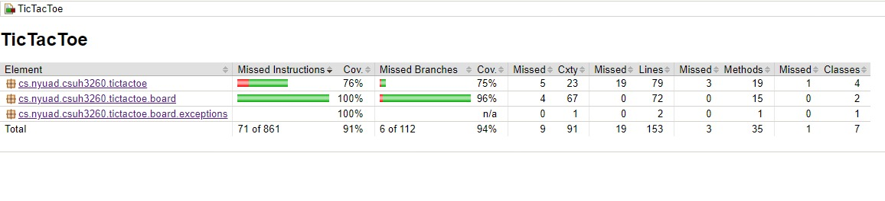

# TicTacToe

TicTacToe is a game played by two players, turn by turn, using a console-based interface. The goal is to set three marks in a row that is either horizontal, vertical, or diagonal in order to win.


## Prerequisites

Before you can run this project, you'll need to have the following installed:

- Java Development Kit (JDK) 21 or higher
- Apache Maven 3.9.6

You can check if you have Java and Maven installed by running the following commands in your terminal:

```bash
java -version
mvn -version
```

### Note : If not already installed, you need to install them.

# How to Build and Run 

You need to go to the directory which you want to compile and then execute the following. 

## Compile the Project

The project has to be compiled using the following Maven command:

```bash
mvn compile
```

## Package the Project

Now package all the contents using the following Maven command:

```bash
mvn package
```

## Run the Game

Finally, execute the game using the following Maven command:

```bash
java -jar target/TicTacToe-1.0-SNAPSHOT.jar
```

## Run Tests

Execute the unit tests using the following Maven command:

```bash
mvn test
```

# How to Play 

- The TicTacToe grid is a 3x3 square.
- Two players play the game locally, one player uses the symbol X, and the other uses O.
- Turns are taken alternately, with players indicating their move by specifying the coordinates of the grid square they wish to mark. 
    - Coordinates are given in the format row,column, starting from 0,0 for the top-left square, up to 2,2 for the bottom-right square.
- The first player to align three of their symbols vertically, horizontally, or diagonally wins the game.
- If all squares are filled and no player has achieved such alignment, the game is a draw.

## Testing Framework

JUnit 4.12

## Code Coverage Tool

JaCoCo 3.3.3 is used to measure the code coverage of our tests. 

## Location of Report

By executing the "mvn test" command, the coverage report is generated and can be found at: 

```bash
TicTacToe-Game/target/site/jacoco/index.html
```

Open the index.html file in a web browser to view the report.




## Test Selection Techniques Used

To develop a comprehensive test suite, a variety of test selection techniques were used. These included:
- Boundary Value Analysis: selecting test cases at the boundaries of the input domains, such as the edges of the board and moves into already occupied squares.
- Equivalency Partitioning: grouping inputs into classes that we expected to behave similarly, such as the game outcomes, i.e. a win, a tie and continuing the game.
- Integration Tests: verifying that combined components of the game function correctly. Accomplished by mocking objects to simulate user inputs and board states. This facilitated the testing of game flow, such as player turns, game termination decisions, and win/tie scenarios. 
